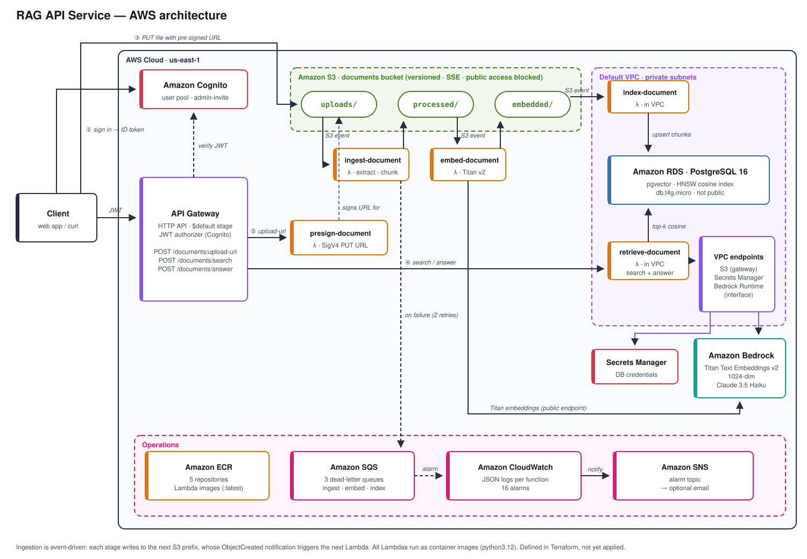
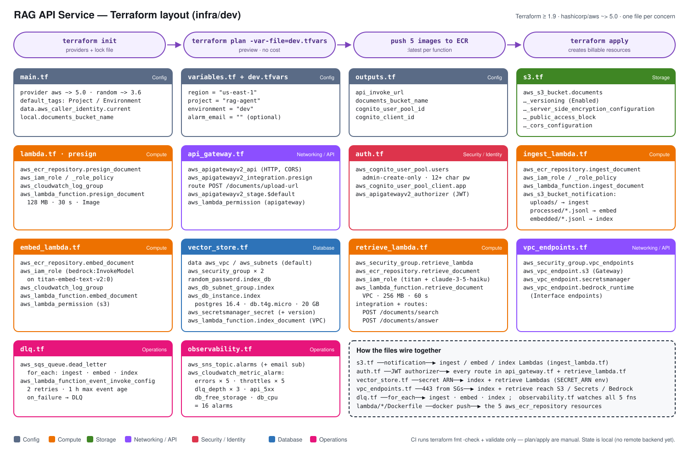

# RAG API Service

[](https://github.com/momoja/Rag-Api-service/actions/workflows/ci.yml)


A serverless **Retrieval-Augmented Generation (RAG)** service on AWS. Upload a document and ask questions about it. The service returns answers grounded in your documents, with citations to the passages it used.

This is a self-managed pipeline, not a managed RAG product like Bedrock Knowledge Bases. Every stage is plain, tested Python in this repo: text extraction, cleaning, chunking, embedding, vector indexing, similarity search and prompt construction. AWS supplies only the building blocks: S3, Lambda, API Gateway, Bedrock models, RDS PostgreSQL with pgvector, Cognito and CloudWatch.

> **Status:** the whole pipeline runs and is tested locally against a real pgvector database. The AWS infrastructure is fully defined in Terraform and passes `terraform validate`, but it **has not been applied** to an AWS account yet.

---

## How it works



### Ingestion (event-driven, asynchronous)

Each stage writes its output to its own S3 prefix. That write emits an S3 event, which triggers the next stage. Every intermediate artifact is kept in S3, so you can inspect it or reprocess from any stage.

| Stage | Trigger | What it does | Output |
|---|---|---|---|
| **presign** | `POST /documents/upload-url` | Validates the key (must start with `uploads/`, no `..`, no absolute paths) and returns a SigV4 pre-signed `PUT` URL valid for 60 to 3600 s (default 900 s) | URL returned to the client |
| **ingest** | S3 `uploads/*` | Extracts text from `.pdf` (pypdf), `.txt` or `.md`. Cleans it (NFKC normalization, control-character removal, whitespace collapse). Splits it into ~1200-character chunks with 200-character overlap, breaking at word boundaries. Derives a deterministic `document_id` from the bucket, key and version | `processed/<document_id>/chunks.jsonl` and `metadata.json` |
| **embed** | S3 `processed/*.jsonl` | Embeds each chunk with **Amazon Titan Text Embeddings v2** (1024 dimensions, normalized) | `embedded/<document_id>/embeddings.jsonl` |
| **index** | S3 `embedded/*.jsonl` | Creates the pgvector schema if missing, then replaces the document's rows in one transaction, so re-ingesting a document is idempotent | `rag_chunks` table with an HNSW cosine index |

### Query (synchronous, HTTP)

| Route | What it does |
|---|---|
| `POST /documents/search` | Embeds the question and returns the `top_k` nearest chunks by cosine distance, optionally filtered to one `document_id` |
| `POST /documents/answer` | Runs the same retrieval, sends the numbered passages to **Claude 3.5 Haiku** on Bedrock with a "use only the context, cite as [n]" system prompt, and returns the answer with its sources |

---

## API reference

Every route requires a Cognito **ID token** in the `Authorization` header. API Gateway validates the token before any Lambda runs and returns `401` if it is missing or invalid.

### Get an upload URL

```http
POST /documents/upload-url
Content-Type: application/json
Authorization: <id-token>

{ "key": "uploads/handbook.pdf", "expires_in": 900 }
```

```json
{
  "method": "PUT",
  "bucket": "rag-agent-dev-documents-123456789012",
  "key": "uploads/handbook.pdf",
  "url": "https://...X-Amz-Signature=...",
  "expires_in": 900
}
```

Then upload the file: `curl -X PUT --upload-file handbook.pdf "<url>"`. Ingestion starts automatically.

### Search

```http
POST /documents/search
{ "question": "What is the refund policy?", "top_k": 5, "document_id": "optional" }
```

```json
{
  "question": "What is the refund policy?",
  "results": [
    { "document_id": "3f1c…", "chunk_index": 4, "text": "…", "distance": 0.21 }
  ]
}
```

### Answer

```http
POST /documents/answer
{ "question": "What is the refund policy?", "top_k": 5 }
```

```json
{
  "question": "What is the refund policy?",
  "answer": "Refunds are issued within 30 days of purchase [1] …",
  "sources": [ { "document_id": "3f1c…", "chunk_index": 4, "text": "…", "distance": 0.21 } ],
  "model_id": "anthropic.claude-3-5-haiku-20241022-v1:0"
}
```

**Limits and validation:** `question` must be at most 2000 characters, and `top_k` must be between 1 and 20 (default 5). Invalid input returns `400` with an `{"error": "..."}` body. Unexpected failures return `500` without leaking internals. If nothing relevant is found, the answer says so and the model is never called.

---

## Tech stack

| Area | Choice |
|---|---|
| Language / tooling | Python 3.12 (matches the Lambda runtime), [uv](https://docs.astral.sh/uv/), Ruff, pytest |
| Compute | AWS Lambda container images (`public.ecr.aws/lambda/python:3.12`), stored in ECR |
| API | API Gateway HTTP API (v2) with a Cognito JWT authorizer |
| Storage | S3 for raw uploads and every intermediate artifact |
| Embeddings | Amazon Bedrock: `amazon.titan-embed-text-v2:0` (1024 dimensions) |
| Generation | Amazon Bedrock: `anthropic.claude-3-5-haiku-20241022-v1:0` |
| Vector store | RDS PostgreSQL 16 + pgvector (`db.t4g.micro`, private), HNSW index, credentials in Secrets Manager |
| Networking | The VPC-attached Lambdas reach S3, Secrets Manager and Bedrock through VPC endpoints |
| Infrastructure | Terraform (AWS provider ~> 5.0), in `infra/dev` |
| Local dev | Docker Compose: Lambda-parity app image + `pgvector/pgvector:pg16` |
| CI | GitHub Actions |

**Python dependencies:** `boto3`, `psycopg[binary]`, `pypdf`. The small dependency list is deliberate. There is no LangChain, LlamaIndex or other RAG framework.

---

## Reliability and observability

- **Retries:** Bedrock calls retry with exponential backoff (3 attempts, capped at 8 s), but only on throttling, timeout and 5xx errors.
- **Permanent vs. transient errors:** pipeline handlers log and **skip** bad content (corrupt PDF, unsupported type, malformed JSONL). They **raise** on transient failures, so Lambda retries the event.
- **Dead-letter queues:** each S3-triggered function has an SQS DLQ and an explicit async retry policy (2 retries, 1-hour maximum event age). Events that still fail after their retries are kept in the queue instead of being lost.
- **Structured logging:** each log line is one JSON object carrying `request_id`, `stage`, `document_id`, `key`, `top_k`, result counts, latency and the caller's identity from the JWT.
- **Alarms:** CloudWatch alarms cover Lambda errors and throttles, DLQ depth, API 5xx responses and RDS storage/CPU. They notify an SNS topic, with optional email via `alarm_email`.
- **Least privilege:** each Lambda has its own IAM role, scoped to its own log group, the S3 prefixes it needs and the specific Bedrock model ARNs it calls.

---

## Project structure

```
.
├── rag_agent/                 # Core library: pure, AWS-agnostic, unit-tested
│   ├── storage.py             # S3 key validation + pre-signed upload URLs
│   ├── ingest.py              # Text extraction, cleaning, chunking, document IDs
│   ├── embed.py               # Titan embeddings + chunks → embeddings stage
│   ├── vector.py              # pgvector schema, idempotent upsert, similarity search
│   ├── retrieval.py           # Question → embedding → top-k chunks
│   ├── generate.py            # Grounded prompt + Claude answer with citations
│   ├── bedrock.py             # Shared retry/backoff for Bedrock calls
│   ├── observability.py       # JSON log formatter + per-invocation context
│   └── apigw.py               # Caller identity from API Gateway JWT claims
├── lambda/                    # Thin Lambda handlers, one container image each
│   ├── presign_document/
│   ├── ingest_document/
│   ├── embed_document/
│   ├── index_document/
│   └── retrieve_document/     # Serves both /search and /answer
├── infra/dev/                 # Terraform for the dev environment
├── docs/images/               # Architecture diagrams (SVG)
├── tests/                     # Unit, handler and DB-gated integration tests
├── .github/workflows/ci.yml   # Lint, tests, image builds, terraform validate
├── Dockerfile                 # Lambda-parity dev/test image
├── compose.yaml               # app (test runner) + db (pgvector)
└── pyproject.toml / uv.lock
```

The handlers in `lambda/` only parse events, call into `rag_agent`, and shape responses or logs. All the business logic lives in the library, so it can be tested without AWS.

---

## Getting started (local, no AWS account needed)

**Prerequisites:** [uv](https://docs.astral.sh/uv/) and Docker Desktop. uv installs Python 3.12 for you.

```bash
git clone https://github.com/momoja/Rag-Api-service.git
cd Rag-Api-service
uv sync                              # create .venv with pinned dependencies

docker compose up -d db --wait       # start pgvector on localhost:5432
uv run pytest                        # full test suite
uv run ruff check . && uv run ruff format --check .
```

The integration tests that need a database skip automatically when no database is running.

`tests/test_pipeline_integration.py` runs the **real** ingest → embed → index → search/answer handlers end to end. It uses an in-memory S3, a fake Bedrock client and the live pgvector database: document bytes go in and a cited answer comes out.

### Run the tests inside the Lambda-parity container

The dev image is hermetic: dependencies and source are built into the image, with no bind mounts. Rebuild it after code changes.

```bash
docker compose build
docker compose run --rm app                    # runs pytest
docker compose run --rm app uv run ruff check .
```

### Build and invoke a Lambda image locally

```bash
docker build -f lambda/presign_document/Dockerfile -t rag-agent-presign:dev .
docker run --rm --entrypoint python \
  -e DOCUMENTS_BUCKET=rag-agent-dev-documents-000000000000 \
  -e AWS_DEFAULT_REGION=us-east-1 -e AWS_ACCESS_KEY_ID=test -e AWS_SECRET_ACCESS_KEY=test \
  rag-agent-presign:dev \
  -c "from handler import lambda_handler; print(lambda_handler({'body': '{\"key\": \"uploads/a.pdf\"}'}, {}))"
```

---

## Infrastructure (Terraform)

All AWS resources are defined in `infra/dev`, one file per concern:



## Deploying to AWS

> Not applied yet. Running `terraform apply` creates billable resources, including an RDS instance, interface VPC endpoints and CloudWatch alarms.

Before you deploy:
- In the Bedrock console, enable model access for **Titan Text Embeddings V2** and **Claude 3.5 Haiku** in your region (the default is `us-east-1`).
- Review `infra/dev/dev.tfvars`. Optionally set `alarm_email`.

Outline:

```bash
cd infra/dev
terraform init
terraform plan -var-file=dev.tfvars
```

Each Lambda runs the `:latest` tag of its own ECR repository. Deploy in this order:

1. Create the ECR repositories (for example with a targeted apply).
2. Build and push the five images from `lambda/*/Dockerfile`.
3. Apply the rest of the stack.

After you apply, Terraform outputs `api_invoke_url`, `documents_bucket_name`, `cognito_user_pool_id` and `cognito_client_id`. The user pool is admin-invite only. Create a user, then get an ID token:

```bash
aws cognito-idp admin-create-user --user-pool-id <pool-id> --username you@example.com
aws cognito-idp initiate-auth --auth-flow USER_PASSWORD_AUTH \
  --client-id <client-id> --auth-parameters USERNAME=you@example.com,PASSWORD=<password>
```

---

## Continuous integration

Every push to `main` and every pull request runs these jobs:

| Job | Checks |
|---|---|
| `lint` | `ruff check` and `ruff format --check` |
| `tests` | Full pytest suite against a pgvector service container, so the DB-gated tests run |
| `container` | Builds the dev image and runs the suite inside it |
| `lambda-images` | Builds all five Lambda images |
| `terraform` | `terraform fmt -check` and `terraform validate` (no credentials, no backend) |

CI deliberately does not run `terraform plan`/`apply` or push images. Those need AWS credentials and a deliberate decision to spend money.

---

## Roadmap

This project was built incrementally, one chapter at a time:

| # | Chapter | Status |
|---|---|---|
| 1 | Project foundation | ✅ |
| 2 | Terraform / IaC | ✅ (defined, not applied) |
| 3 | Docker / local development | ✅ |
| 4 | AWS Lambda + Python | ✅ |
| 5 | API layer | ✅ |
| 6 | Document ingestion | ✅ |
| 7 | Embeddings | ✅ |
| 8 | Vector storage | ✅ |
| 9 | Retrieval | ✅ |
| 10 | LLM generation | ✅ |
| 11 | End-to-end pipeline | ✅ |
| 12 | Production hardening | 🟡 Partial |

**Deferred:** API rate limiting, caching, retrieval-quality evaluation, staging/prod environments, remote Terraform state, a deploy workflow, and cost/performance tuning.

**Current limitations:**
- Supported formats are `.pdf`, `.txt` and `.md`. Scanned PDFs are not OCR'd.
- Chunks are embedded one at a time.
- The Lambdas deploy from the mutable `:latest` image tag.

---

## Acknowledgements

The architecture of this project was informed by AWS's Advanced RAG Assistant sample. The sample was studied for architectural and design inspiration; this implementation was developed independently.
